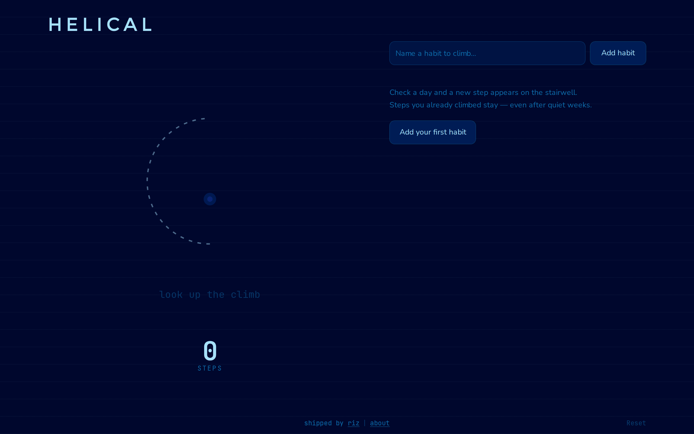
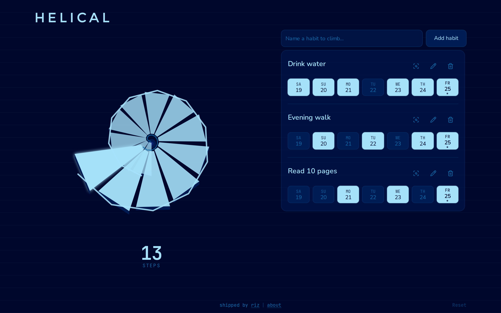

# Helical

Helical is a smol habit tracker project that is low-stakes yet powerful.

The name comes from a helical staircase: a continuous curve of steps winding upward around an open center.

Habits are steps you take as you ascend to reach your destination.

Each habit completed in a day increases the overall step count, so, even if you miss out reading a book, for example, you still made progress if you achieved going on a walk. Helical rewards some progress in some things over punishing missing a day or not completing every single one of your habits, daily. Of course, when you’re ready for it, you can zoom into stats for each habit.

Another inspiration when thinking about habits and staircases was the stair stepper machine you’ll find at the gym. The step/day stat mimics the speed readout of the stepper machine as it records the average of how many steps you take on the days you climb. Check off 3 habits on Monday and 1 on Thursday, and it shows 2 steps/day and not a lower average spread across the whole week.

Habits, really, are just steps.

So, what are you climbing towards?

## Screenshots

### Empty



### Populated week



### Mobile


## Run locally

```bash
npm install
npm run dev
```

Open [http://127.0.0.1:43127](http://127.0.0.1:43127).

Production build:

```bash
npm run build
npm start
```

## What you can do

- Create, rename, and remove habits
- Mark (or undo) completion for any day in the rolling 7-day week
- See lifetime steps on the looking-up stairwell — missed days never erase past climbs
- Watch climb stats rotate through steps, pace, and habits
- Use it comfortably on phone or desktop

## How data is stored

Everything lives in your browser’s `localStorage` under the key `helical.habits.v1`:

- Habit names and ids
- Completion history as unique `(habitId, date)` pairs using **local calendar** dates (`YYYY-MM-DD`)

Nothing is sent to a server. Clearing site data for this origin also clears Helical.

## Reset to empty

Use **Reset** in the footer and confirm, or run this in the browser console on the Helical tab:

```js
localStorage.removeItem("helical.habits.v1")
location.reload()
```

## Refresh screenshots

With the app running on port `43127`:

```bash
node scripts/capture-readme-screenshots.cjs
```
